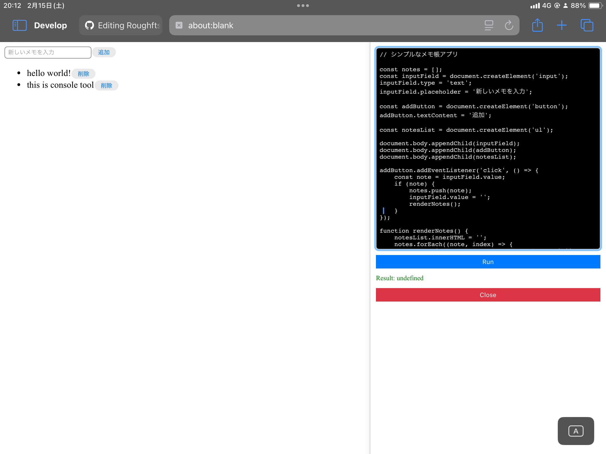
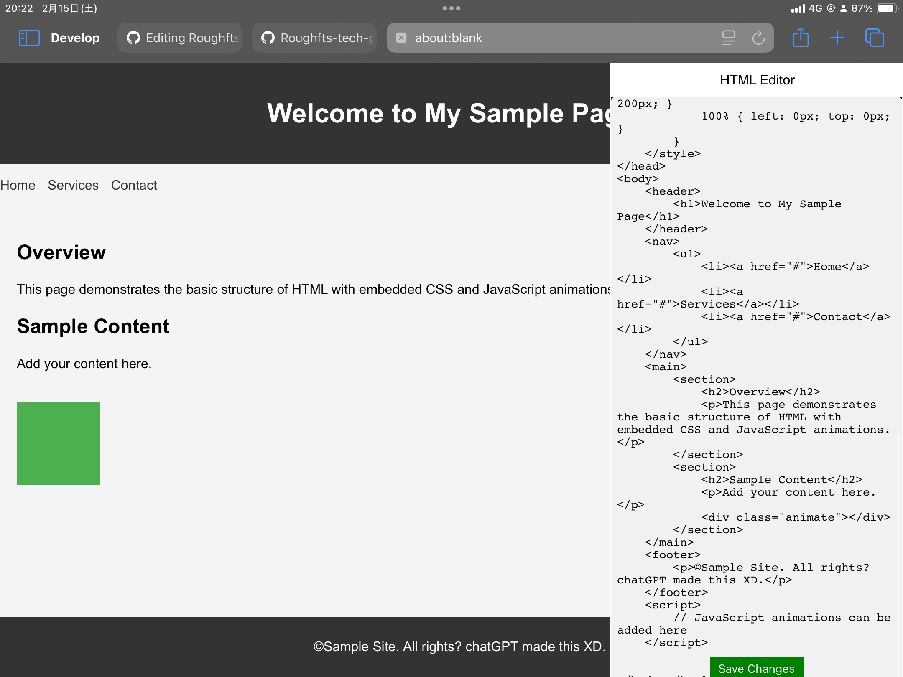

## Overview

iPadや、スマホ向けの、開発者ツール。ブックマークレットとしてパッケージ化された、外出先でもDOMやjsが触れる。

実装の背景、主要機能、運用上の注意点をREADMEの読み味で整理しています。

## Background

- プロジェクト: 開発者ツールブックマークレット
- 目的: 短文サマリーではなく、再利用しやすい実装ドキュメントとして残す
- 方針: デモ向け説明よりも、実装意図と運用条件を優先

## Key Features

### 開発ツール

- HTMLを表示（要素の表示）
- editHTML（ソースの検証のDOMを部分的に）
- jsコンソール（エラーは出力されない、console.logではなく、alertで代用）

## Tech Stack

- JavaScript
- Developer Tools
- Debugging Utilities
- Bookmarklet
- DOM
- js
- Dev
- Console
- Utilities
- 開発ツール
- デバッグユーティリティ
- ブックマークレット

## Implementation Notes

- 実装は速度優先で小さく回し、必要に応じて段階的に機能追加
- ユーザー体験を壊しやすい箇所（同期、権限、外部API制約）を先に固定
- 学習用途と実運用用途の境界を明示し、用途に応じて使い分ける設計

## README Notes

このツールは「本格DevToolsの代替」ではなく、モバイル環境で最低限の検証を行うための軽量セットです。

1. 対象ページを開いた状態でブックマークレットを起動
2. HTML表示で現在DOMを確認
3. editHTMLで必要箇所のみを部分編集して再確認
4. JSコンソール機能で簡易スクリプトを実行

## Operational Constraints

- モバイル向けのため、デスクトップDevToolsほどの深い追跡は非対応
- console.log の代替に alert を使うため、長文ログには不向き
- ページ構造によってはDOM編集結果が即時反映されない場合がある

## Future Improvements

- ログ表示UIの改善（alert依存を縮小）
- DOM差分表示の導入
- モバイル画面でも扱いやすい補助操作の追加

## Links

- [GitHub](https://github.com/Stasshe/-school-filtering-ignore/tree/main/%E3%83%96%E3%83%83%E3%82%AF%E3%83%9E%E3%83%BC%E3%82%AF%E3%83%AC%E3%83%83%E3%83%88/%E9%96%8B%E7%99%BA%E8%80%85%E5%90%91%E3%81%91%E3%83%84%E3%83%BC%E3%83%ABDeveloper%20tool)

## Screenshots

