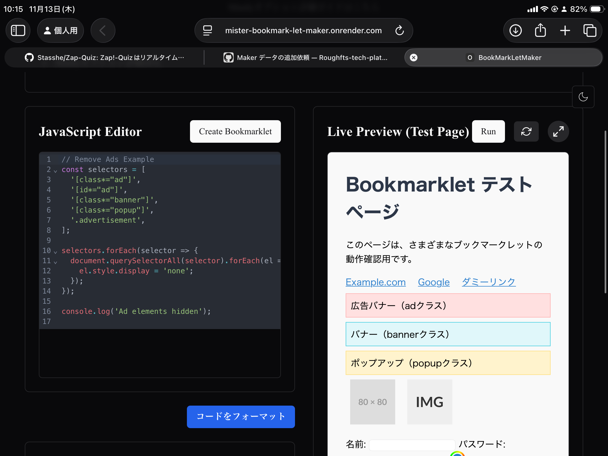
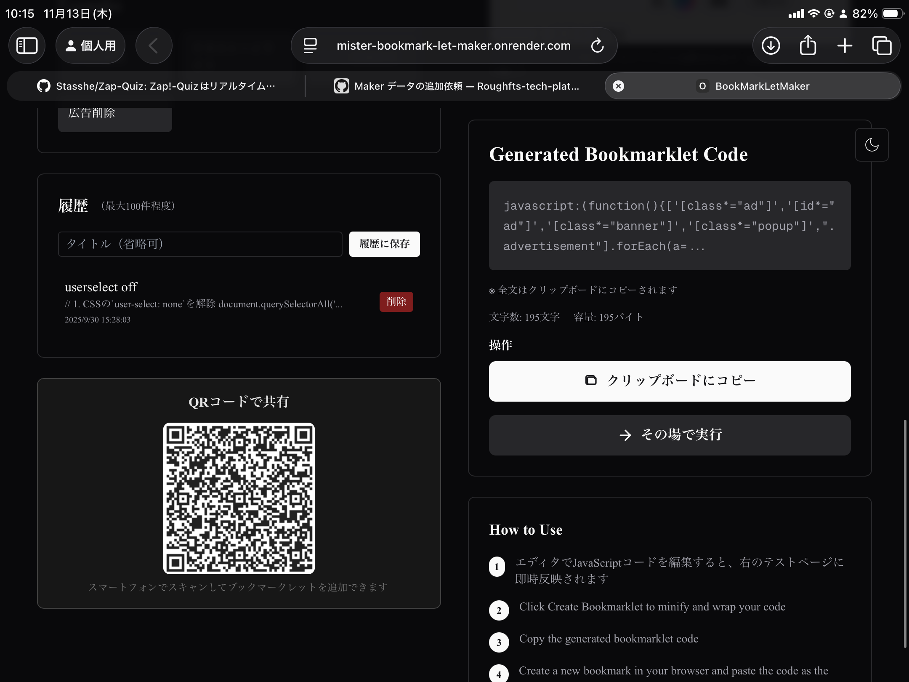

## Overview

直感的なWeb UIでブックマークレットを作成・編集・管理するツール。生成したコードは最適化・縮小され、すぐにブックマークへ保存できます。

実装の背景、主要機能、運用上の注意点をREADMEの読み味で整理しています。

## Background

- プロジェクト: ブックマークレットメーカー
- 目的: 短文サマリーではなく、再利用しやすい実装ドキュメントとして残す
- 方針: デモ向け説明よりも、実装意図と運用条件を優先

## Key Features

### ビジュアルエディタ

- コードスニペットのドラッグ＆ドロップ
- ターゲットページでのライブプレビュー
- 最適化されたブックマークレットコードをエクスポート

### 管理機能

- 作成したブックマークレットの保存・編集
- タグやカテゴリによる整理

## Tech Stack

- React
- TypeScript
- Next.js
- Vercel

## Implementation Notes

- 実装は速度優先で小さく回し、必要に応じて段階的に機能追加
- ユーザー体験を壊しやすい箇所（同期、権限、外部API制約）を先に固定
- 学習用途と実運用用途の境界を明示し、用途に応じて使い分ける設計

## README Notes

READMEに合わせた基本フローは次のとおりです。

1. エディタでJavaScriptコードを編集
2. 右側プレビューで挙動を即時確認
3. Create Bookmarkletでminify済みコードを生成
4. Copy to Clipboardでブラウザへ登録

## Links

- [GitHub](https://github.com/Stasshe/BookMarkLetMaker)
- [Vercel](https://bookmarklet-maker.vercel.app/)

## Screenshots

