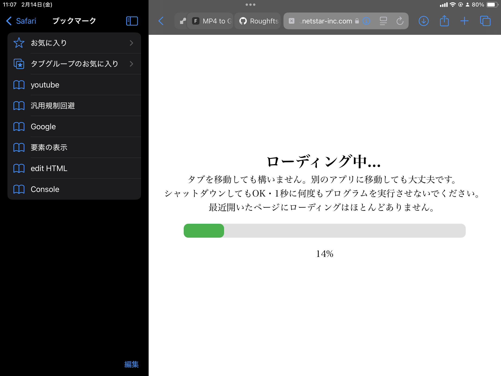
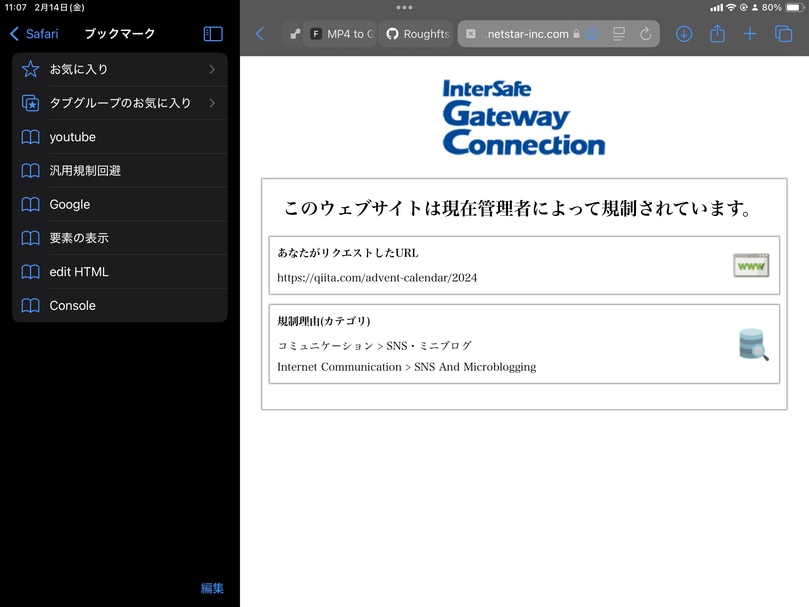
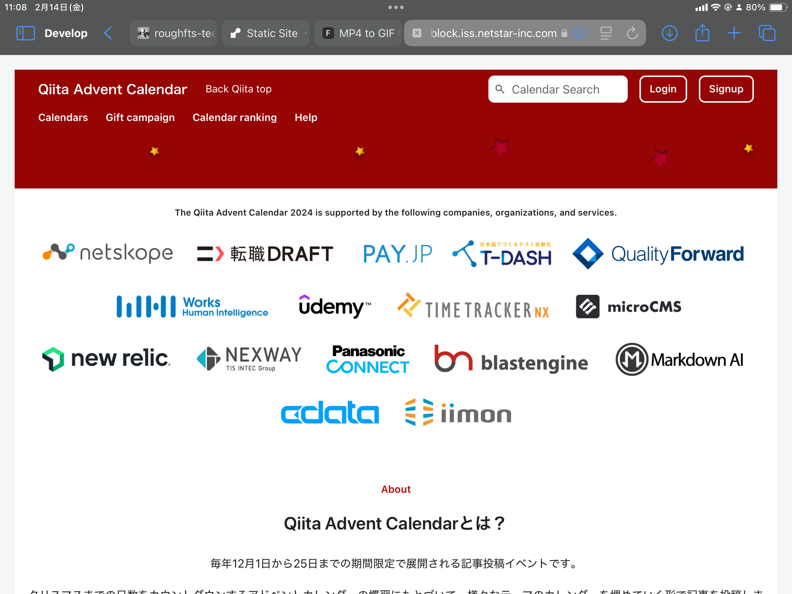

## Overview

サイトが規制されても大丈夫。ブックマークレットから規制を突破して、学校に対抗しよう!

## Tech Stack

- JavaScript
- DOM Scraping
- Data Parsing
- Bookmarklet
- Regulation Evasion
- Site

## Key Features

- **機能**: api.allorigins.winを使ってサイトのコンテンツを取得 / これ自体はサイトじゃないからブロックの確率はかなり低い

## Links

- [GITHUB](https://github.com/Stasshe/-school-filtering-ignore/tree/52e67c116feebfe8e95e8fb1a5edc54070274789/%E3%83%96%E3%83%83%E3%82%AF%E3%83%9E%E3%83%BC%E3%82%AF%E3%83%AC%E3%83%83%E3%83%88/%E3%82%B5%E3%82%A4%E3%83%88web)

## Gallery

