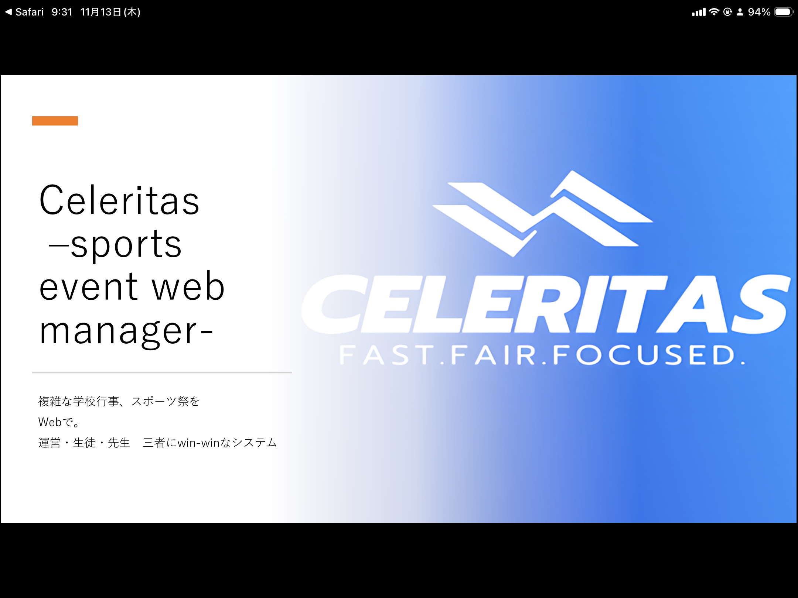
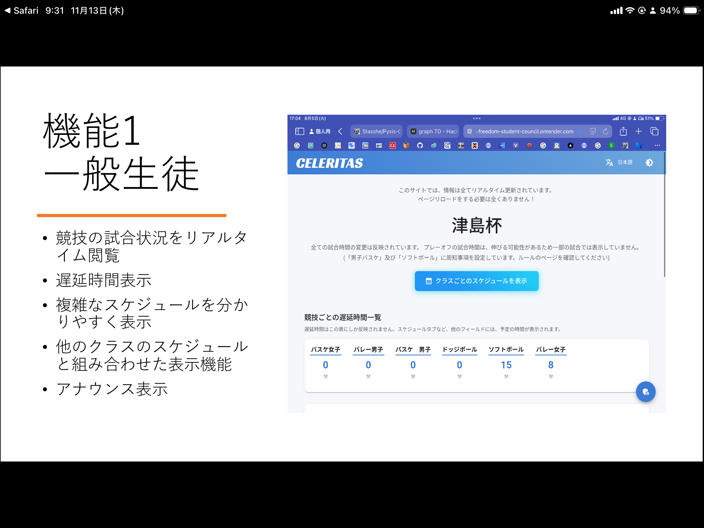
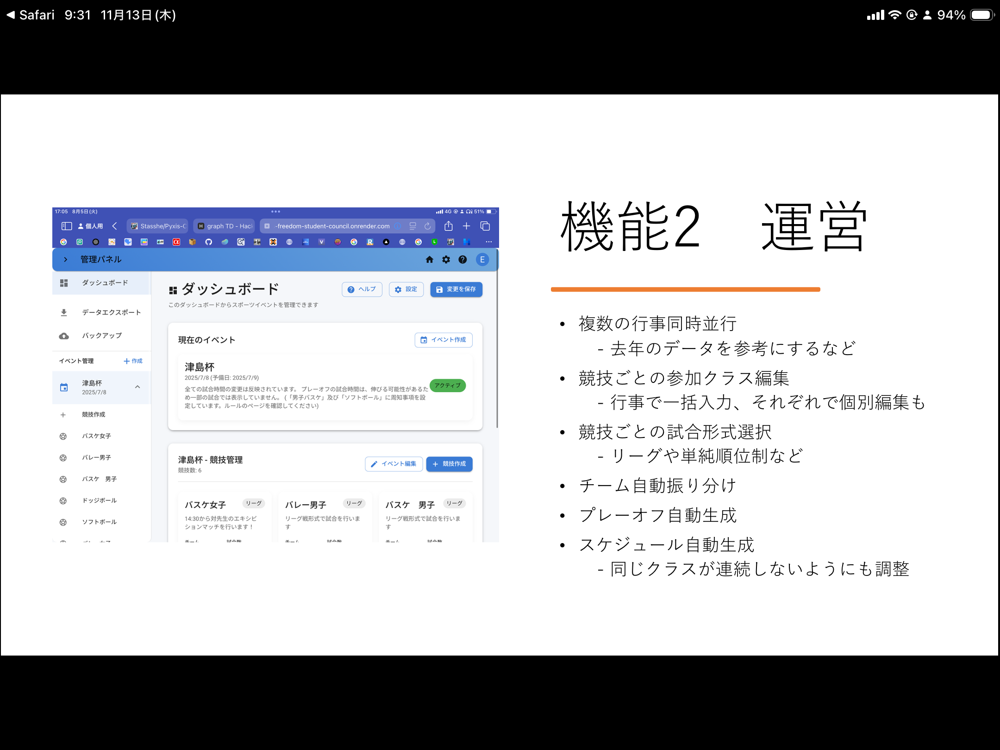
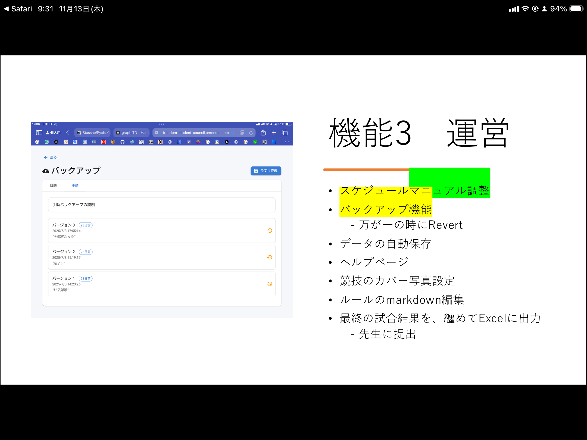

## Overview

Celeritas は、学校行事の現場運用で起きる「情報の分断」「更新遅延」「手作業過多」を同時に解決するために設計したスポーツイベント運営システムです。単なる結果表示ページではなく、運営スタッフの管理画面と一般生徒の閲覧体験を一体化し、当日の進行そのものを支えるオペレーション基盤として機能します。

## Background

従来運用では、以下の課題が同時に発生していました。

### 生徒会側の課題

- 競技進行や結果更新が手作業で、担当者に業務が集中
- 準備期間が短く、引き継ぎ不足が起きやすい
- スケジュール変更時の連絡コストが高い

### 一般生徒側の課題

- 試合状況や進行遅延を把握しづらい
- 暑い中、現地に行かないと情報が得られない
- トーナメント進出状況が直感的に分からない

この状況に対して、Celeritas では「運営側の編集体験」と「閲覧側の即時性」を同時最適化しました。

## What I Built

### 1. Real-time Operation Core

- Firebase Realtime Database による即時同期
- スコア入力と同時に全端末へ状態反映
- 進行中・完了・遅延など試合ステータスを一元管理

### 2. Competition & Format Flexibility

- トーナメント、総当たり、リーグ、ランキング形式をサポート
- 3位決定戦、敗者復活戦など運用ルール差分にも対応
- 競技ごとのルール説明・運営メモを保持

### 3. Schedule Planning System

- 複数コート同時進行のタイムライン管理
- 試合枠・休憩枠・準備片付け枠を分離して編集可能
- 変更時の影響を可視化しやすいレイアウト

### 4. Admin Workflow Support

- 管理ダッシュボードでイベント全体を俯瞰
- ロスター編集、チーム管理、競技設定、スコア登録を分離
- ヘルプページ内蔵で引き継ぎ時の学習コストを軽減

### 5. Student-facing Experience

- 閲覧専用でも十分に情報が取れる画面構成
- 順位推移・進出状況を追いやすい表示
- 現地移動なしで、今どの試合を見るべきか判断しやすい導線

## Tech Stack

- React 18
- TypeScript
- Material UI
- Firebase Realtime Database / Authentication
- Framer Motion
- i18next
- ExcelJS
- @g-loot/react-tournament-brackets

## Architecture Notes

- フロントエンドは React + TypeScript で、画面責務を管理系と閲覧系に明確分離
- データ同期は Firebase を中心に設計し、複数端末編集時の整合性を担保
- エクスポート機能は ExcelJS を利用し、公式記録に転用しやすい形へ出力
- 多言語ファイルを分離し、行事運営以外への横展開も可能な構成

## Implementation Scope

実装には以下のモジュール群を含みます。

- 管理画面: ダッシュボード、バックアップ、エクスポート、ロスター編集
- 競技画面: 種目詳細、タイムライン、トーナメント、総当たりテーブル
- 共通基盤: 認証コンテキスト、テーマ管理、DB連携フック、i18n
- ユーティリティ: スケジュール生成、トーナメント表示補助、形式別エクスポータ

## Outcome

- 想定ピーク約150同時接続で運用
- 本番運用時の重大インシデントなし
- 手作業依存の集計負荷を大幅に削減
- 運営スタッフ・一般生徒の双方で情報アクセスが改善

## Links

- [GitHub Repository](https://github.com/Stasshe/celeritas-sports-event-web-manager)

## Gallery

