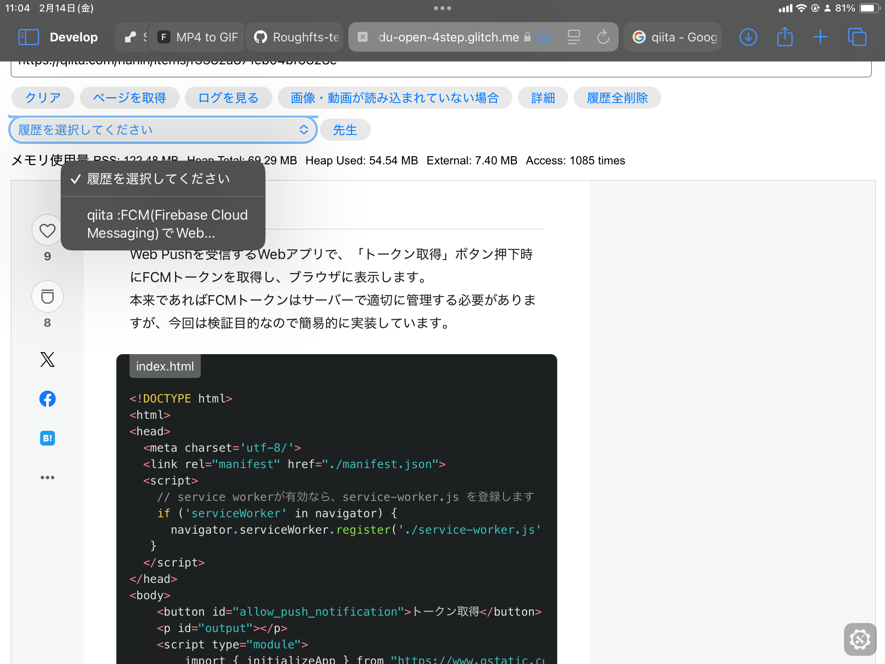
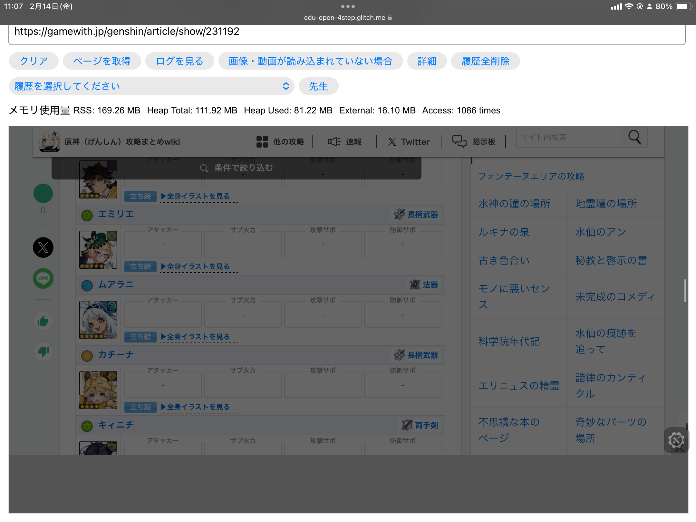

## Overview

学習環境の閲覧制限下でも、必要なページへ到達するために作成した動的プロキシ系サイトです。

構成を意図的にシンプルにし、`server.js` と `index.html` を中心に導入できるようにしています。

## Design Policy

- Git操作に慣れていない人でも扱いやすい
- 無料ホスティング環境で再現可能
- 複雑な設定を避け、入力して使うだけの構成

## Flow

1. URLを入力
2. サーバー側で代理取得
3. URLを分割・再構成して到達性を補助
4. 結果をブラウザへ返却

## Tech Stack

- JavaScript
- CSS
- REST API
- Network Protocols

## Key Points

- Glitch / Renderでのデプロイに対応
- 最小ファイル構成で検証を開始しやすい
- 短時間で動作確認まで進められる

## Limits

- 高負荷運用は想定外
- 対象サイトによっては完全再現できない
- 利用規約の確認と適切な利用が前提

## Links

- [GITHUB](https://github.com/Stasshe/-school-filtering-ignore/tree/52e67c116feebfe8e95e8fb1a5edc54070274789/Web%E3%82%B5%E3%82%A4%E3%83%88)
- [GLITCH](https://edu-open-4step.glitch.me)

## Gallery

