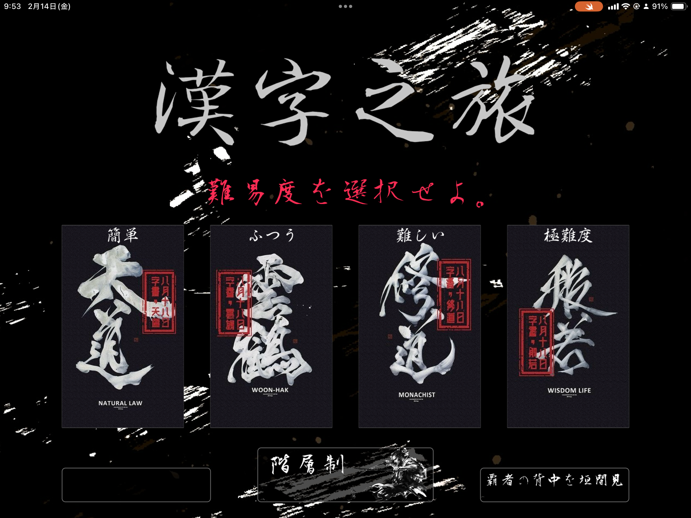
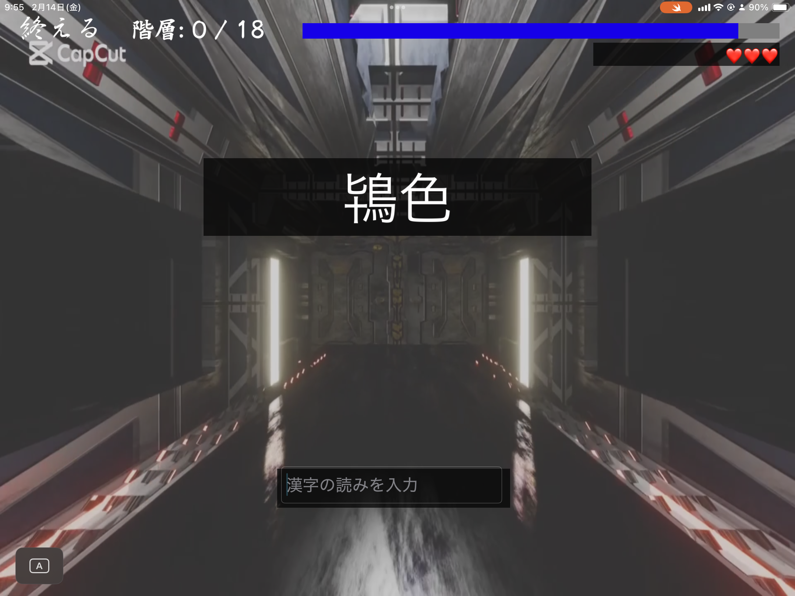
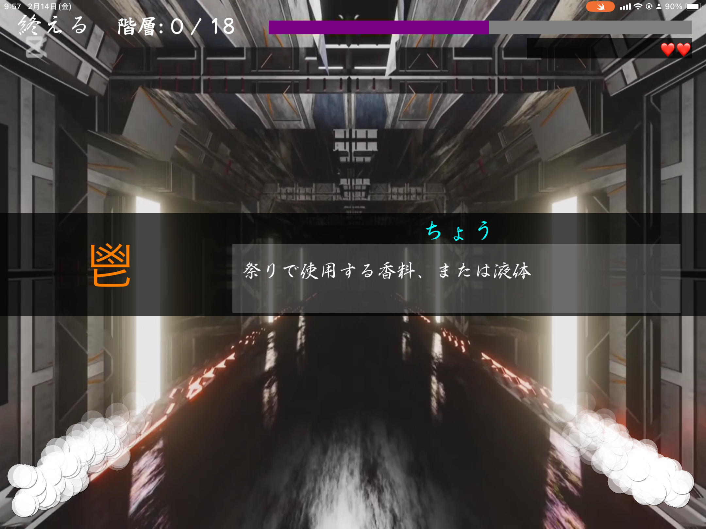
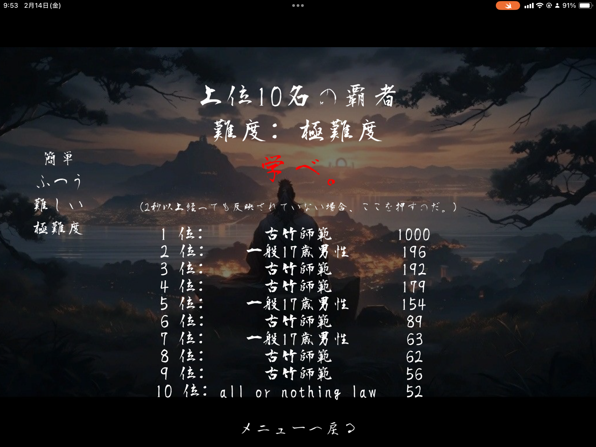
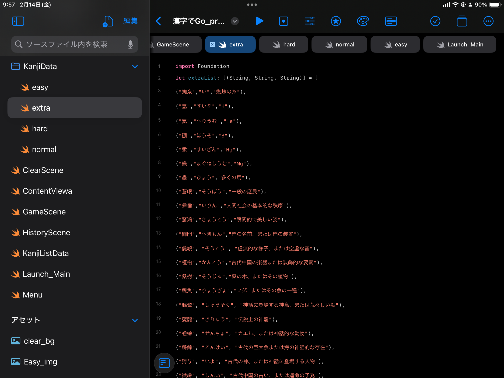

## Overview

クラシックな「漢字でGO!」のリメイク版で、強化されたビジュアルと改良された難易度レベルの漢字チャレンジを提供します。

実装の背景、主要機能、運用上の注意点をREADMEの読み味で整理しています。

## Background

- プロジェクト: 漢字の旅 - リメイク版
- 目的: 短文サマリーではなく、再利用しやすい実装ドキュメントとして残す
- 方針: デモ向け説明よりも、実装意図と運用条件を優先

## Key Features

### ゲームモード

- 漢字でGO!のリメイク版
- 演出を和風にし、よりかっこいいグラフィックを。
- 漢字でGO!にはなかった、アンリミテッドモード
- 無制限モードでは、到達階層をオンラインランキングに反映できる
- 収録漢字はほとんどが全てChatGPTなので、真偽には注意。

## Tech Stack

- Swift
- SpriteKit
- UIKit
- Game
- iOS
- App
- Firebase Realtime Database
- Online
- Ranking
- Playgrounds

## Implementation Notes

- 実装は速度優先で小さく回し、必要に応じて段階的に機能追加
- ユーザー体験を壊しやすい箇所（同期、権限、外部API制約）を先に固定
- 学習用途と実運用用途の境界を明示し、用途に応じて使い分ける設計

## Links

- [GitHub](https://github.com/Stasshe/Kanji-de-Go-remake)

## Screenshots

