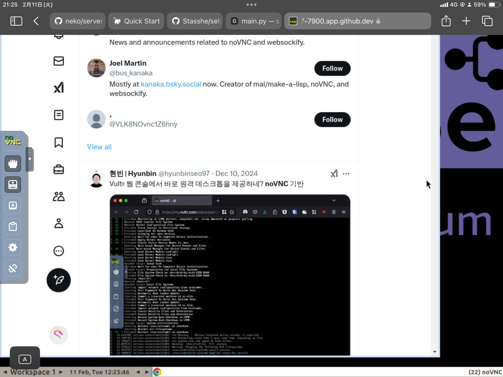
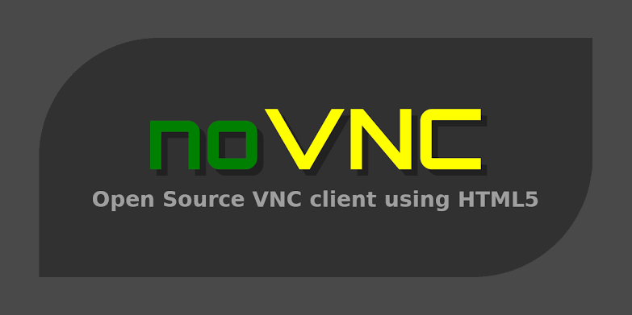

## Overview

Selenium仮想ブラウザをCodespacesのDockerで立ち上げ

## Tech Stack

- Python
- Selenium
- Docker
- noVNC
- Codespaces
- Virtual

## Key Features

- **100%規制回避**: Selenium仮想ブラウザをCodespacesのDockerで立ち上げて、それをnoVNCで操作 / スクレイピングとは違い、100%の規制回避を実現

## Links

- [GITHUB](https://github.com/Stasshe/selenium-Docker-noVNC)

## Gallery

