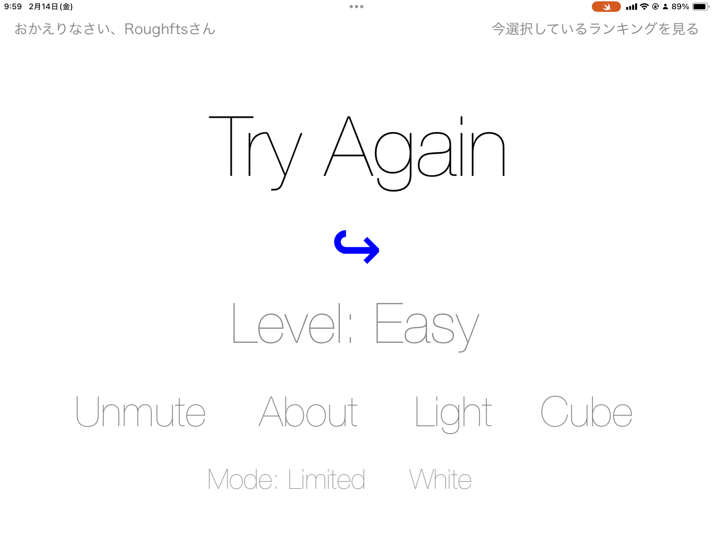
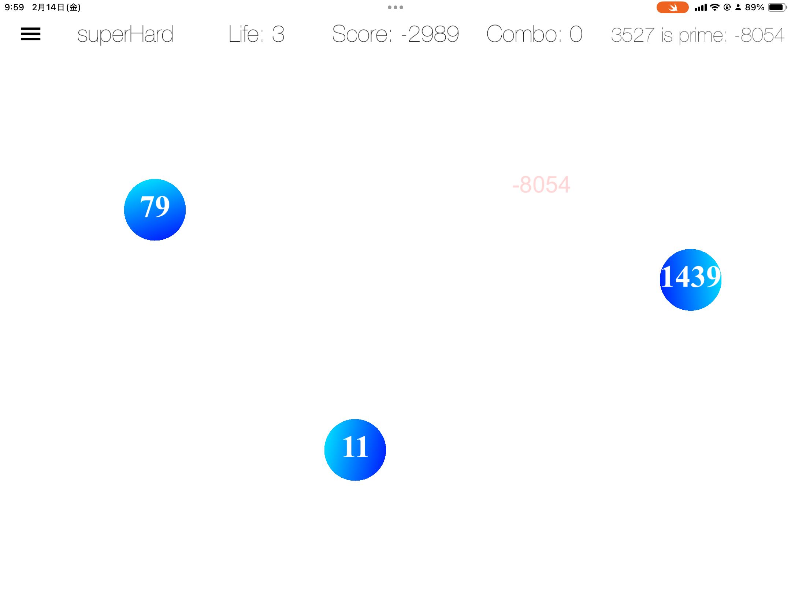
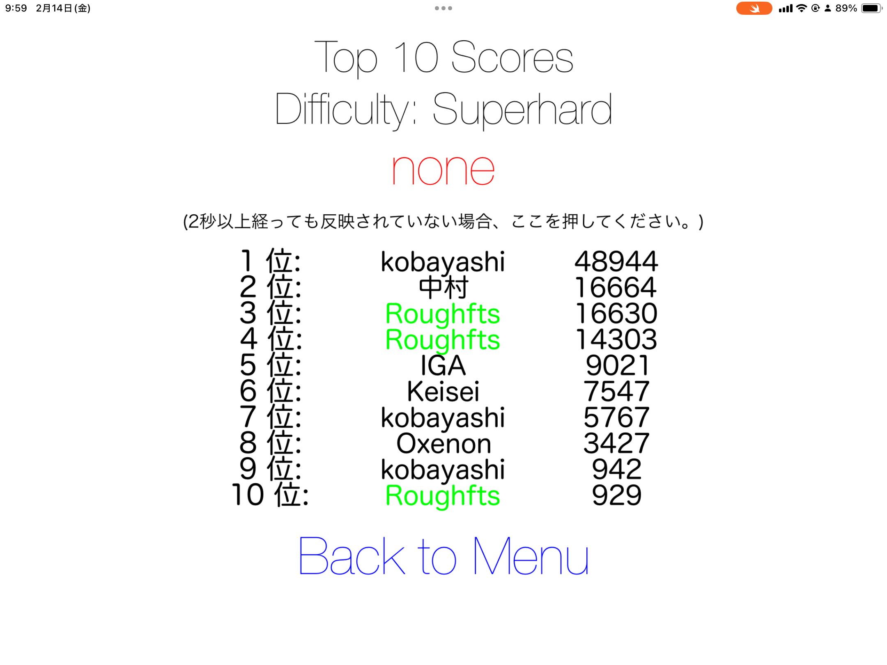
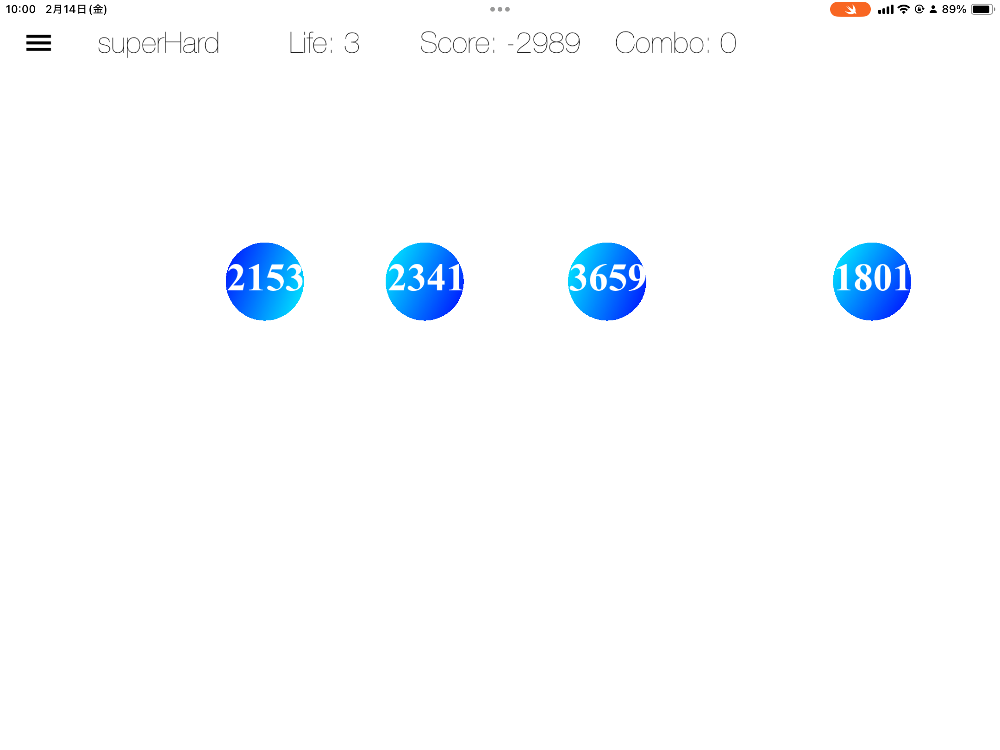

## Overview

合成数キューブをタップ・スライスして素因数に分解する、操作感重視の数学ゲームです。

「問題を解く」だけでなく、「反応して分解する」体験へ置き換えることで、学習と爽快感の両立を狙いました。

## Design Intent

- 素因数分解をゲーム操作に翻訳
- 難易度の段階化で継続プレイを促進
- コンボと倍率で上達実感を可視化

## Core Systems

- タップベースの分解アクション
- コンボ倍率スコアリング
- ライフ制とペナルティ
- 大きい数向けヒント機能
- Easy〜Specialまでの複数モード

## Tech Stack

- Swift
- SpriteKit
- UIKit
- GameplayKit
- CoreAnimation

## Balancing Notes

- 学習性を保ちつつ爽快感を落とさない調整が重要
- 高難易度では読みやすさと速度のバランスを継続調整

## Result

数学ゲームとしての堅さを保ちつつ、繰り返し遊びたくなるリズムを作れました。

## Links

- [GITHUB](https://github.com/Stasshe/Split-into-the-Prime)

## Gallery

