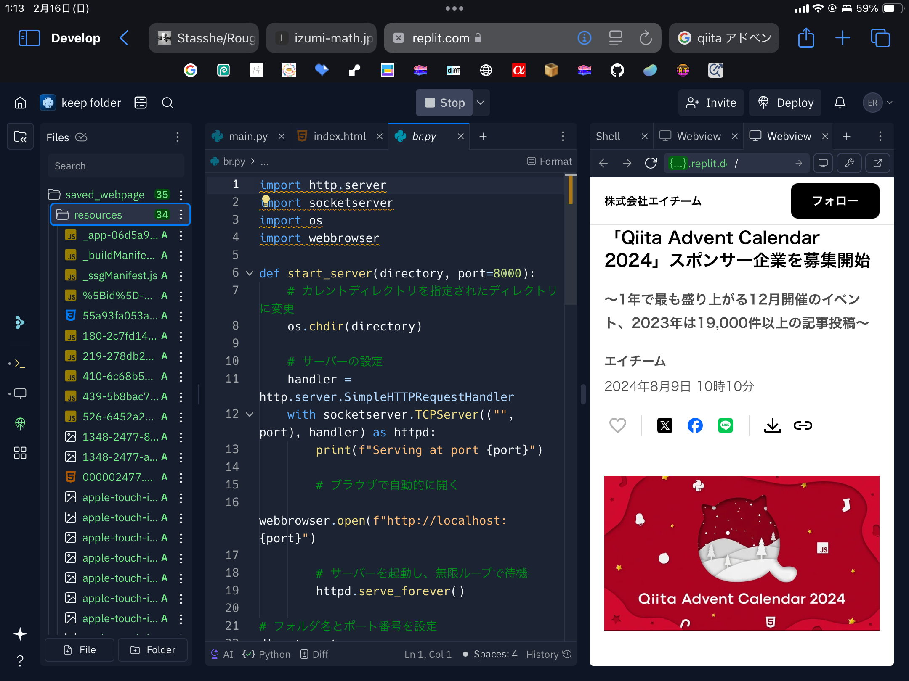
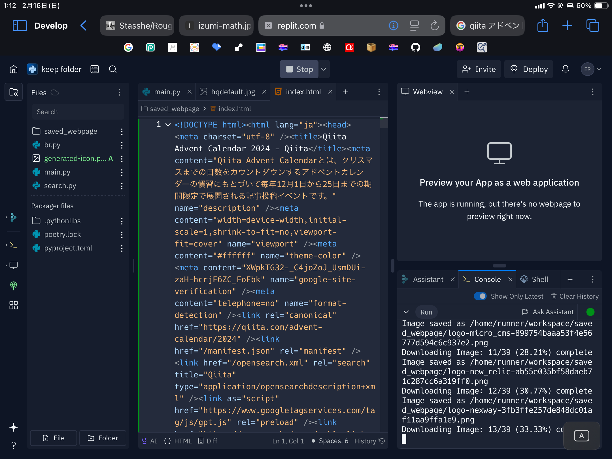

## Overview

Pythonを使ったサイト規制回避

実装の背景、主要機能、運用上の注意点をREADMEの読み味で整理しています。

## Background

- プロジェクト: Pythonフィルターバイパス
- 目的: 短文サマリーではなく、再利用しやすい実装ドキュメントとして残す
- 方針: デモ向け説明よりも、実装意図と運用条件を優先

## Key Features

### 主要機能

- 静的サイトはほとんど見れる
- 画像処理系も得意
- 推奨環境はreplit
- ブラウザ実装より検証コストが高い
- Google Colab では常用しづらいケースがある

## Tech Stack

- Python
- Socket Programming
- Network Protocols
- Proxy Server
- HTTP/HTTPS
- サイト規制回避
- HTML
- replit

## Implementation Notes

- 実装は速度優先で小さく回し、必要に応じて段階的に機能追加
- ユーザー体験を壊しやすい箇所（同期、権限、外部API制約）を先に固定
- 学習用途と実運用用途の境界を明示し、用途に応じて使い分ける設計

## README Notes

この実装は「簡単に配布するためのツール」というより、通信処理を理解するための検証ベースです。

1. Python実行環境を準備（replit前提が最も再現しやすい）
2. 対象URLを入力してHTTP/HTTPS取得を実行
3. 取得したHTMLを解析して必要情報を抽出
4. 想定外レスポンスはログ化して再試行条件を調整

## Operational Constraints

- JavaScript版より初期セットアップが重い
- 実行環境ごとの差分（ネットワーク・証明書周り）が発生しやすい
- 実運用よりも、プロトコル理解と難ケース検証に向く

## Future Improvements

- エラーハンドリングとリトライ戦略の標準化
- 取得結果の保存形式を整理して比較しやすくする
- 実行環境別の手順差分をREADMEに明記

## Links

- [GitHub](https://github.com/Stasshe/-school-filtering-ignore/blob/main/Python/%E3%82%B9%E3%82%AF%E3%83%AC%E3%82%A4%E3%83%94%E3%83%B3%E3%82%B0save%20web:local.py)

## Screenshots

