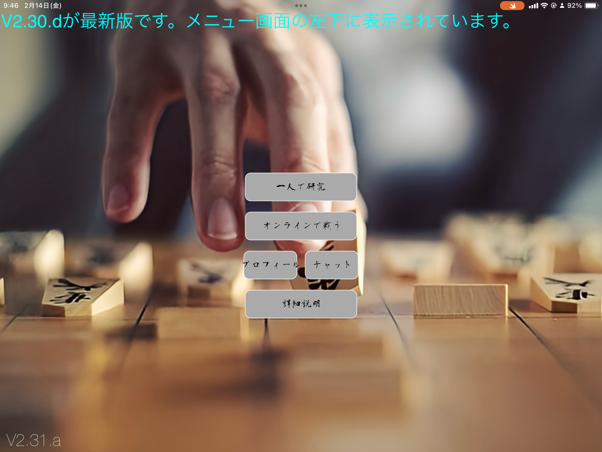

## Overview

一人で研究、AI、オンラインプレイヤー機能を全て一つに。他にはない集約力。

## Tech Stack

- Swift
- SpriteKit
- Firebase
- WebSocket
- GIKOU AI API
- UIKit

## Key Features

- **ゲーム詳細**: 他のどんなアプリにもない、研究モード中の、棋譜保存や駒の自由配置のON/OFF機能 / オンラインでは、ルームを作成すると自動でチャットシステムに通知が出て参加可能

## Links

- [GITHUB](https://github.com/Stasshe/ShogiAPP-CeConV2.31)

## Gallery

