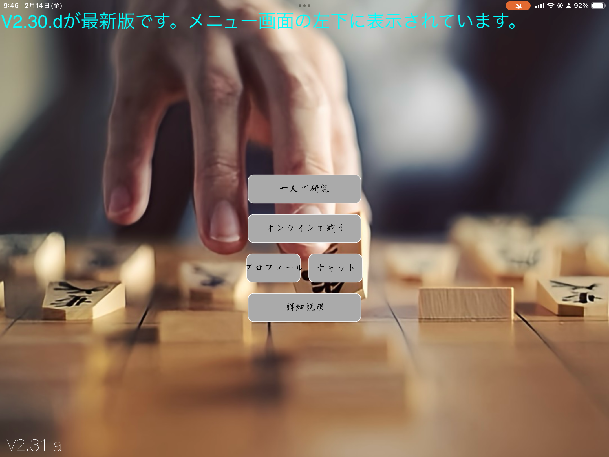

# Shogi App - CeConV2.31

### *一人で研究する。AIと打つ。誰かと打つ。全部、ひとつのアプリで。*

---

## ひとことで言うと

将棋を学ぶ・練習する手段は、いつも分かれていました。棋譜を並べ直す研究用アプリ、AIと対局するアプリ、友達とオンラインで打つアプリ — 別々のツールを行き来するのが当たり前でした。

CeConV2.31は、その3つ（**研究 / AI対局 / オンライン対戦**）を1つのSwiftアプリに統合しています。盤面のコアロジックは1つ、UIも1つ。モードが切り替わるだけで、駒の動き・反転表示・棋譜保存はすべて共通の土台で動きます。

## 解決したい課題

学校や自宅で将棋の腕を磨きたいとき、欲しい機能は意外と一つのアプリに揃っていません。

- 研究したいときに、盤面を自由に組み替えられない
- AIと打ちたいときに、棋力に合った相手が手元にない
- 友達と打ちたいときに、部屋を立てる→気づいてもらう、までの導線が長い

CeConV2.31は、この3つを「モード切り替え」だけで行き来できるようにし、さらに**観戦モード**で対局を理論上1000人まで同時に見られるようにしました。一人の練習から、教室での共有まで、同じアプリでカバーする狙いです。

## 主な機能

- **研究モード** — 駒の自由配置ON/OFF、棋譜保存のON/OFFを個別に切り替え可能。盤面を好きな局面から組んで検討できる
- **AI対局モード** — 将棋AI「技巧」の公開APIを利用した対AI対局
- **オンライン対戦** — ルーム作成と同時にチャットへ自動通知。知り合いをその場で誘える設計
- **チャット機能（public / private）** — 対局中の個人チャットと、ルーム全体への通知を分離
- **観戦モード** — 対局を後から覗ける。理論上1000人同時視聴に対応
- **盤面反転・盤面の永続化** — アプリを閉じても最後の盤面を保持
- **基本ルールの実装** — 王手・二歩などの判定を実装（千日手はルールの揺れが大きいため非対応と判断）

| よくあるアプリ | CeConV2.31 |
|:---|:---|
| 研究/AI/対人が別アプリ | 1アプリでモード切替 |
| ルーム作成→個別共有 | チャットに自動通知 |
| 観戦不可、または人数制限 | 理論上1000人同時観戦 |

## デモ動画

<video src="assets/cecon/online-match-demo.mp4" controls playsinline style="max-width:100%; border-radius:12px;"></video>

*オンライン対戦の様子。相手の着手がリアルタイムに反映される。*

## 技術スタック

- **Swift / UIKit** — アプリ全体の構築
- **SpriteKit** — 盤面・駒のレンダリングとアニメーション
- **Firebase** — オンライン対戦のルーム管理・チャット
- **WebSocket** — 対局中のリアルタイム着手同期
- **GIKOU AI API** — 「技巧」エンジンを外部公開APIとして利用したAI対局
- **CoreData** — 棋譜・盤面状態のローカル永続化

## 技術的に踏んだ地雷

研究モードの自由配置、オンライン対戦の同期、棋譜の巻き戻し・コピペ — この3つの機能はそれぞれ単体なら単純ですが、**同時に存在させた瞬間に組み合わせ爆発**を起こしました。実際に踏んだ地雷の一部です。

- 棋譜を巻き戻した状態から保存設定を切り替えて試合を進めると、保存インデックスがずれて上書きが起きる
- 王（玉）を取った後に巻き戻す・進めるを繰り返すと、先手・後手の判定が入れ替わる
- 盤面情報をコピー&ペーストすると、持ち駒が複製されたりスキップされたりする
- 盤面反転中に手数を移動すると、駒の向きが反転したまま固定される
- オンライン対戦で片方が再入室すると、手番が先手側にリセットされる

これらは「機能ごとに正しい」が「状態の組み合わせとして矛盾する」典型例でした。1つずつ再現条件を絞り込み、`v2.26`〜`v2.31`にかけて潰していきました。

## 開発の軌跡

- `v0.8` コンソール上で将棋のルールを実装
- `v1.0` GUI・基本機能を実装
- `v1.8` 一人で研究モードがひとまず完成
- `v2.0` オンライン対戦を実装
- `v2.20` チャット機能を追加
- `v2.26` 巻き戻し・コピペ周りの一連の状態不整合バグを修正
- `v2.28` ルームIDのチャットからのコピー対応、巻き戻し中のクラッシュ修正
- `v2.30` 対戦中の個人チャット、王手判定を追加
- `v2.31` オンライン対戦で相手の着手位置が分からない問題を解消

## 既知の制約

- AI対局は「一人で研究」モードのみで利用可能（技巧APIの制約に合わせた仕様）
- 技巧APIはSFENクエリ中の成駒記号 `+` をURLエンコード後にデコードしておらず、成駒が通常駒として扱われる場合がある。サーバー側の挙動のため現状は仕様として受け入れている
- 千日手は判定ルールが分かれるため非対応
- オンライン対戦は回線状況に依存し、最速1秒・平均3秒程度のラグが発生することがある

## ライセンス

画像素材はPixabay / Pinterest等を使用。個人利用目的のアプリのため、詳細なクレジットは省略しています。

技巧AIについては、エンジン作者およびAPI化を行った方に感謝します。

## リンク

- [GitHub](https://github.com/Stasshe/ShogiAPP-CeConV2.31)

## スクリーンショット

