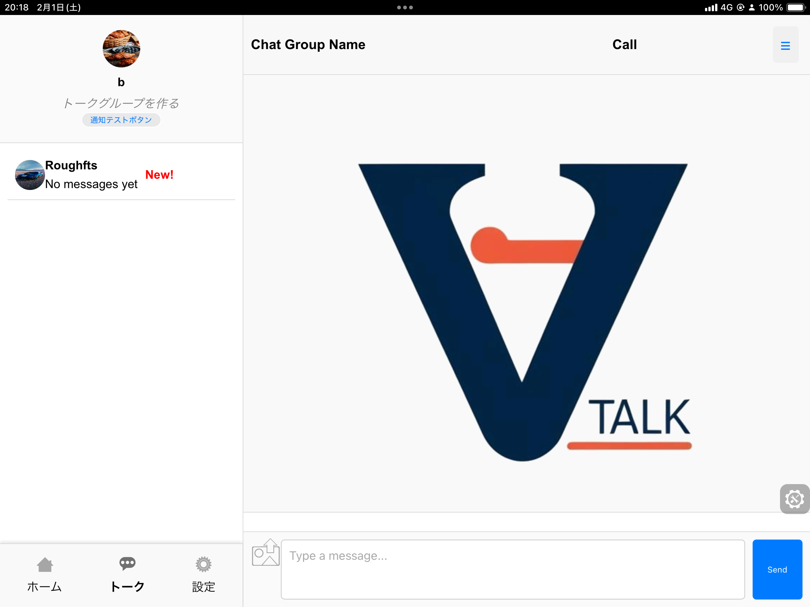
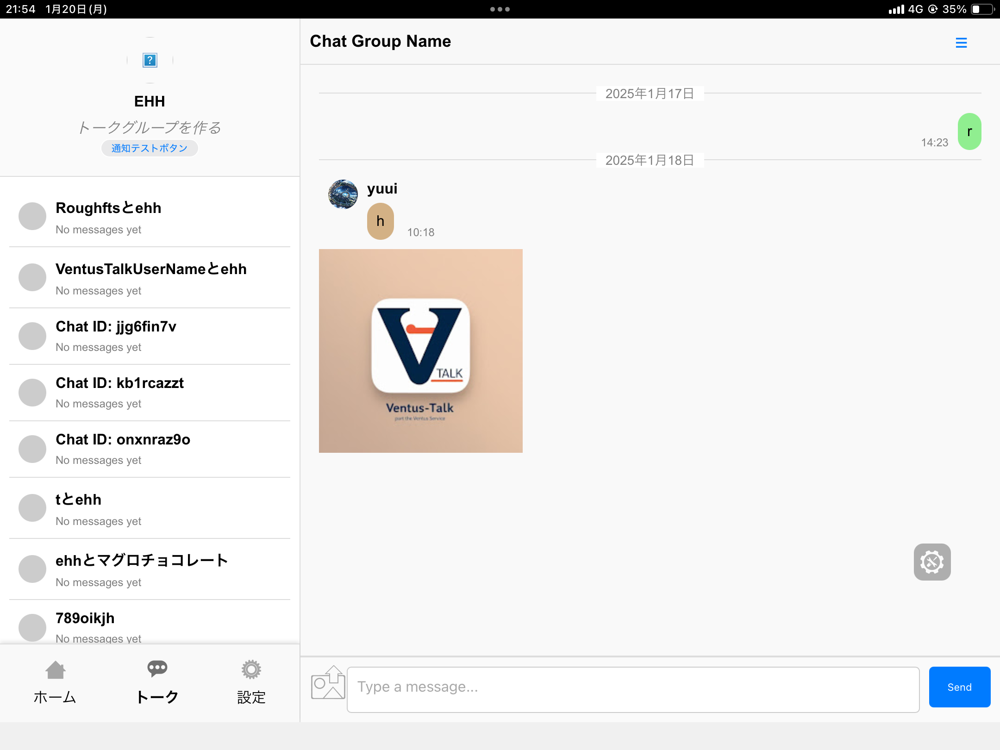
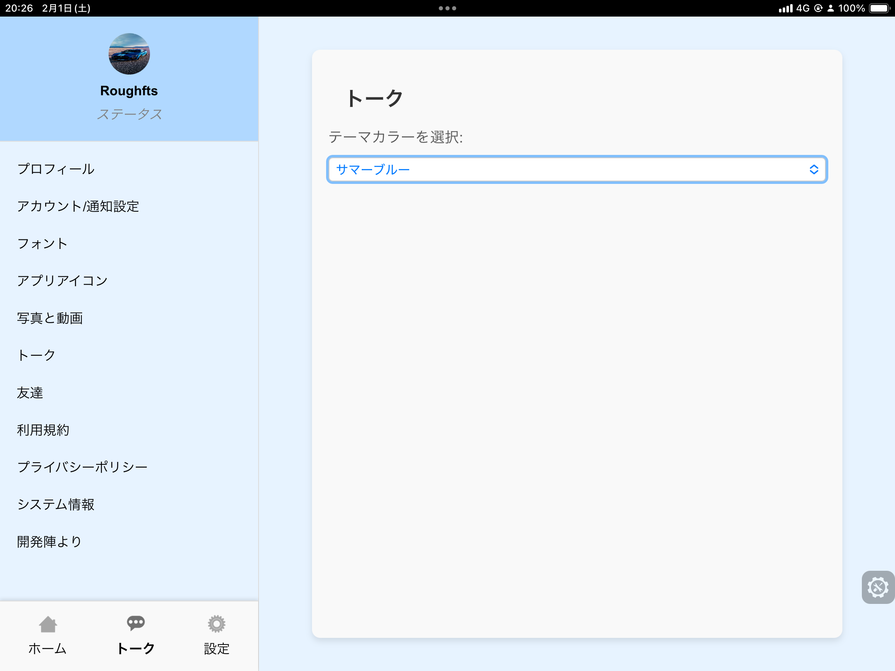
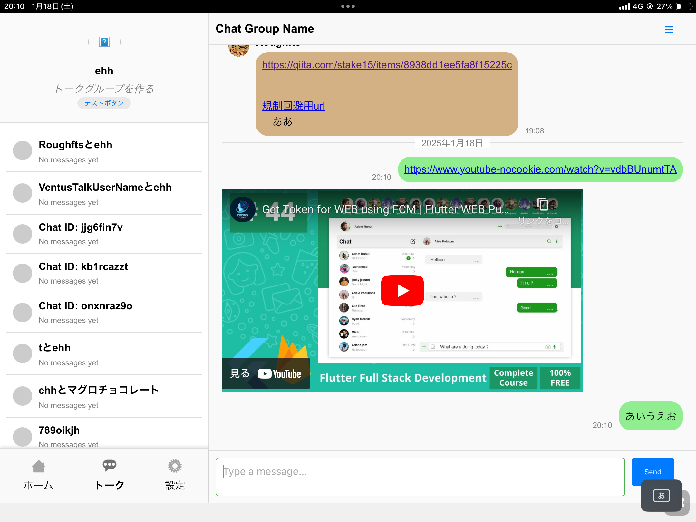
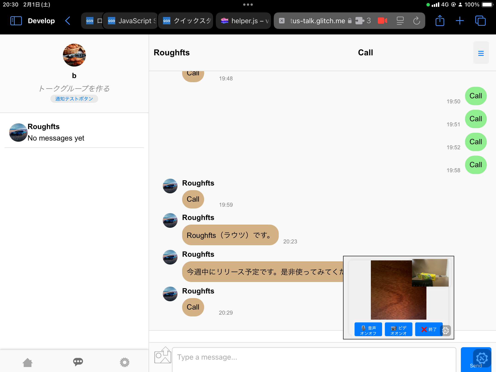

## Overview

高性能なリアルタイムチャットアプリケーションで、高度な機能と最適化されたユーザー体験を提供します。

## Tech Stack

- Firestore
- JavaScript
- PWA
- FCM (Firebase Cloud Messaging)
- Google Drive API
- WebRTC

## Key Features

- **主要機能**: 0.05-0.15秒の更新速度でのリアルタイムメッセージング / 4つのFirestoreサーバーによるマルチサーバーアーキテクチャ

## Links

- [GITHUB](https://github.com/stasshe/ventus-talk)
- [GLITCH](https://ventus-talk.glitch.me)
- [RENDER](https://ventus-talk.onrender.com)

## Gallery

