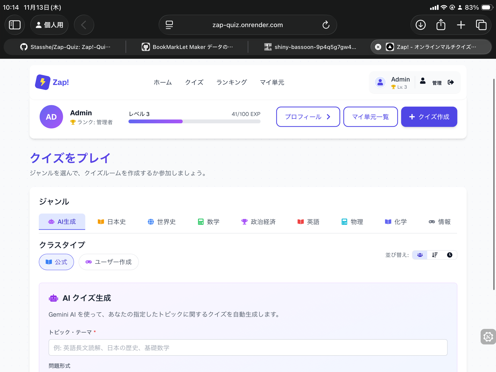
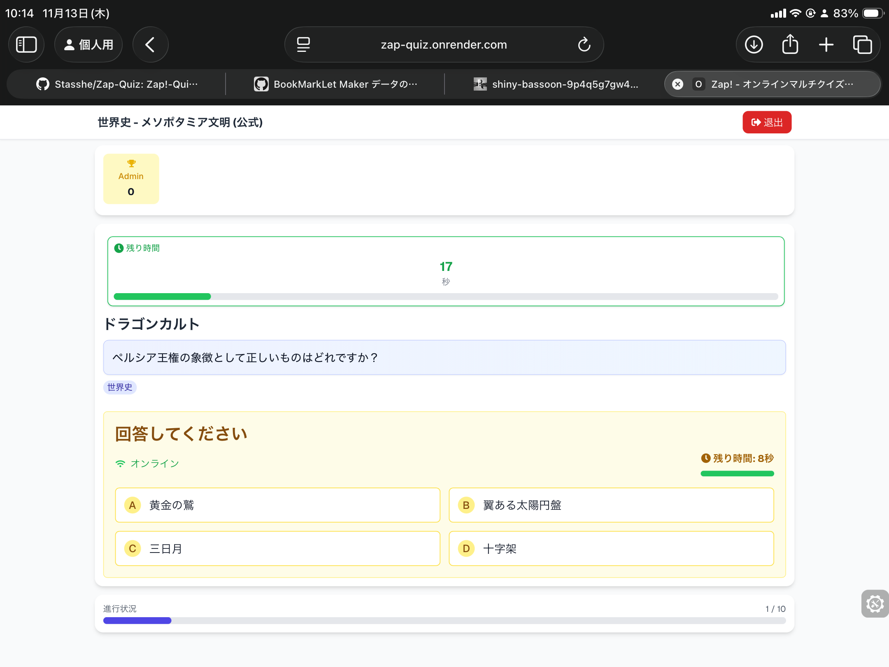

## Overview

Zap!-Quizは、早押し形式や記述式に対応したリアルタイムマルチプレイヤーオンラインクイズアプリです。公式の体系的な問題とユーザー作成クイズの両方に対応します。

実装の背景、主要機能、運用上の注意点をREADMEの読み味で整理しています。

## Background

- プロジェクト: Zap!-Quiz
- 目的: 短文サマリーではなく、再利用しやすい実装ドキュメントとして残す
- 方針: デモ向け説明よりも、実装意図と運用条件を優先

## Key Features

### リアルタイムマルチプレイヤー

- 早押し（最速回答者）システム
- ルームリーダーモデルによる安定した進行
- Firestoreによるリアルタイム同期

### 多様な出題形式

- 早押し・選択式・記述式に対応
- 複数の正答パターン（表記ゆれ対応）を登録可能

### 公式コンテンツとユーザー作成

- 世界史・日本史などの体系的な公式問題
- ユーザーが簡単にクイズを作成・共有可能

## Tech Stack

- Next.js 15
- React 19
- TypeScript
- Tailwind CSS
- Firebase (Firestore, Authentication)
- framer-motion
- zustand
- katex
- js-yaml

## Implementation Notes

- 実装は速度優先で小さく回し、必要に応じて段階的に機能追加
- ユーザー体験を壊しやすい箇所（同期、権限、外部API制約）を先に固定
- 学習用途と実運用用途の境界を明示し、用途に応じて使い分ける設計

## README Notes

READMEでは、Firebaseを前提にしたセットアップと、ルーム参加から作問までの一連フローを明示しています。

1. 認証付きでアカウントを作成
2. 公式クイズまたはユーザー作成クイズに参加
3. 早押しと記述回答で対戦
4. 統計・ランキングで学習状況を確認

## Links

- [GitHub](https://github.com/Stasshe/Zap-Quiz)

## Screenshots

